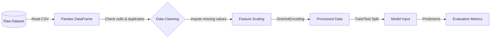
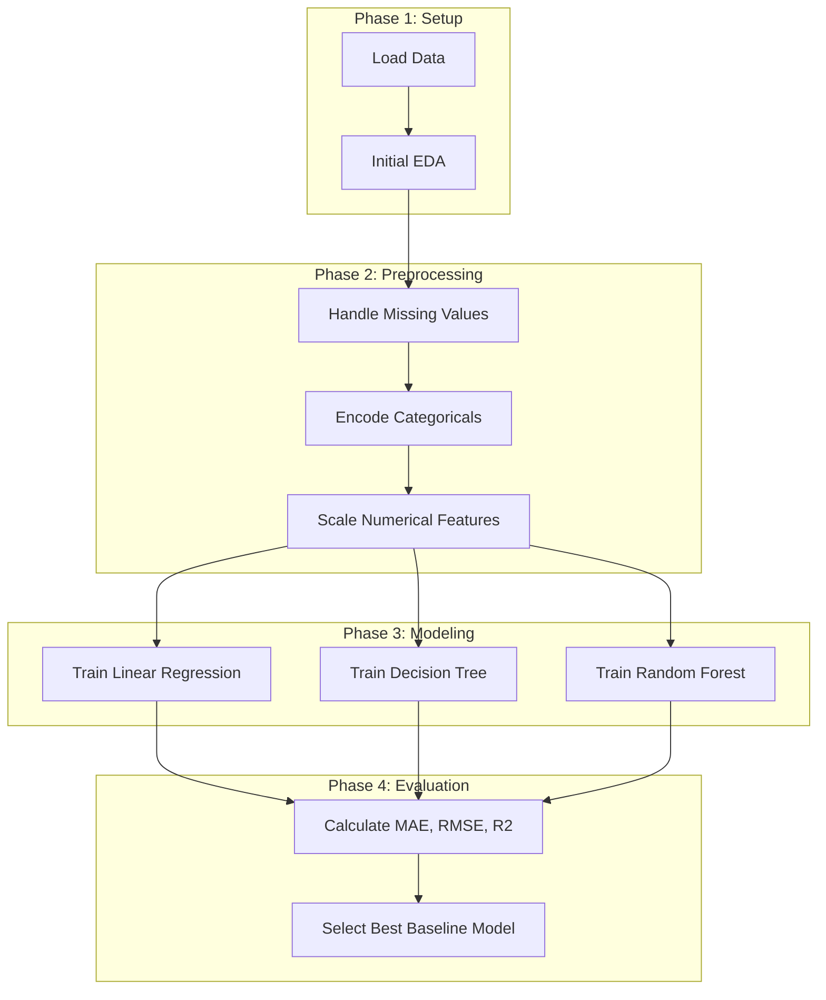

# System Architecture

This document describes the high-level architecture, data flow, and machine learning workflow for the House Price Prediction System. 

## 1. High-Level Architecture Diagram

```mermaid
graph TD
    A[Data Source (Kaggle/CSV)] --> B[Data Ingestion]
    B --> C[Data Preprocessing Module]
    C --> D[Exploratory Data Analysis]
    C --> E[Model Training & Evaluation]
    E --> F[Baseline Models]
    F --> G[Performance Reports]
    
    classDef default fill:#f9f9f9,stroke:#333,stroke-width:2px;
```

## 2. Data Flow Diagram



## 3. ML Workflow Diagram



## 4. Team Role Allocation

For an academic MLOps project, roles are typically distributed to cover all lifecycle phases:

| Role | Responsibilities |
|---|---|
| **Data Engineer** | Dataset acquisition, cleaning, preprocessing pipelines, and managing data quality. |
| **Data Analyst** | Conducting Exploratory Data Analysis (EDA), generating visualizations, and uncovering feature insights. |
| **Machine Learning Engineer** | Designing baseline models, writing training/evaluation scripts, and optimizing model performance. |
| **Documentation Lead** | Structuring the project proposal, literature survey, and maintaining system architecture diagrams. |
